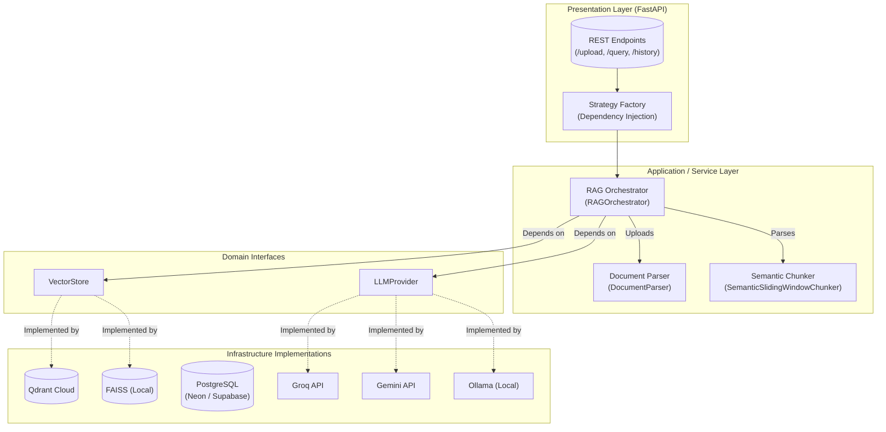

# Production-Grade Cloud-Native RAG Semantic Search Engine

A fully modular, production-ready Retrieval-Augmented Generation (RAG) platform. Built with Python 3.12, FastAPI, and Clean Architecture principles, this engine serves as a cloud-native semantic search service capable of indexing thousands of documents and returning lightning-fast, hallucination-free answers.

## 🌟 Features

- **Cloud-Native & Hybrid Architecture:** Use managed services (Qdrant Cloud, Neon Postgres, Groq/Gemini API) for zero-infrastructure deployment, or spin up everything locally via Docker Compose.
- **Pluggable Vector Databases (Strategy Pattern):** Easily swap between `QdrantVectorStore` (Primary) and `FAISSVectorStore` (Local Fallback) using `.env`.
- **Pluggable LLM Providers:** Dynamically switch between `Groq`, `Gemini`, or local `Ollama` without touching the business logic.
- **Intelligent Semantic Chunking:** Sliding window chunker using `tiktoken` that preserves sentence boundaries to maintain context.
- **Robust Ingestion:** Hybrid PDF parsing using `PyMuPDF` for speed and `pdfplumber` for complex layouts. Detects duplicates via SHA-256 content hashing.
- **High-Performance APIs:** Built on asynchronous `FastAPI` with 10 robust endpoints for querying, document management, and conversational history.
- **Structured Observability:** Detailed latency metrics logging for embeddings, retrieval, and inference.

## 🏗️ Architecture

This repository strictly adheres to **Clean Architecture**. The core domain is isolated from infrastructure layers using Dependency Inversion.



## 🛠️ Technology Stack

- **Core:** Python 3.12+, AsyncIO
- **Backend:** FastAPI, Uvicorn, Pydantic Settings
- **Databases:** PostgreSQL (SQLAlchemy ORM, Alembic), Qdrant Cloud (Vector DB)
- **AI/ML:** Sentence-Transformers, Groq API, Gemini API, PyMuPDF, Tiktoken
- **DevOps:** Docker, Make, Pytest

## 🚀 Quick Start (Local Development)

### 1. Clone & Initialize
```bash
git clone https://github.com/yourusername/rag-search-engine.git
cd rag-search-engine
make init
```

### 2. Virtual Environment Setup

**Linux / macOS:**
```bash
python3 -m venv venv
source venv/bin/activate
make install
```

**Windows:**
```powershell
python -m venv venv
.\venv\Scripts\activate
make install
```

### 3. Environment Variables
Copy the `.env.example` file and configure it:
```bash
cp .env.example .env
```
*(Ensure `DATABASE_URL`, `QDRANT_API_KEY`, and `GROQ_API_KEY` are populated)*

### 4. Database Migrations
Initialize the PostgreSQL schema using Alembic:
```bash
make migrate
```

### 5. Run the Server
```bash
make dev
```
The API is now running at `http://localhost:8000`. 
View the interactive OpenAPI Docs at `http://localhost:8000/api/v1/docs`.

## 🐳 Docker Deployment (Production Ready)

The application is completely containerized following Docker best practices (multi-stage builds, non-root user, slim images). 

It features two deployment modes: **Mode A** (All local containers) and **Mode B** (Application container only, leveraging Cloud services).

### Prerequisites
- Docker Engine installed
- Docker Compose v2+ installed

### Mode A: Full Local Stack (App + Postgres + Qdrant)
Run this if you do not want to use cloud database providers. This mode spins up local Docker containers for PostgreSQL and Qdrant.

1. Ensure your `.env` is configured for local connections (see `.env.example`).
2. Start the stack using the `local` profile:
```bash
docker compose --profile local up --build -d
```
3. The API will be available at `http://localhost:8000/api/v1/docs`.
*(Note: Database migrations run automatically via `entrypoint.sh` on startup).*

### Mode B: Cloud-Native Mode (App Only)
Run this if you are using Neon/Supabase PostgreSQL and Qdrant Cloud.

1. Ensure your `.env` contains your Cloud Database and Qdrant credentials.
2. Start only the API container:
```bash
docker compose up --build -d
```

### Docker Volume Persistence
Both the PostgreSQL database and Qdrant index store their data in persistent Docker volumes (`postgres_data`, `qdrant_data`). Uploaded files are stored in a host bind mount `./uploads`.

To completely wipe all persistent data:
```bash
docker compose --profile local down -v
```

### Viewing Logs
```bash
docker compose --profile local logs -f
```

## 📊 Endpoints & Usage

### 1. Upload a Document
```bash
curl -X POST "http://localhost:8000/api/v1/upload" \
  -H "accept: application/json" \
  -H "Content-Type: multipart/form-data" \
  -F "files=@sample_documents/report.pdf"
```

### 2. Semantic Query
```bash
curl -X POST "http://localhost:8000/api/v1/query" \
  -H "accept: application/json" \
  -H "Content-Type: application/json" \
  -d '{
    "query": "What are the key findings in the report?",
    "top_k": 3
  }'
```

### 3. System Metrics
```bash
curl -X GET "http://localhost:8000/api/v1/metrics"
```

## 🧪 Testing & Benchmarks

Run the unit test suite:
```bash
make test
```

Run the benchmark suite to measure real chunking throughput, embedding vectorization speeds, and FAISS/Qdrant latency:
```bash
make bench
```

## 🤝 Contribution Guidelines
We welcome PRs! Please ensure you run `make format` (which uses Black and Ruff) and verify tests pass (`make test`) before submitting code.

## 📄 License
This project is licensed under the MIT License.
